# Requirements  
1. ‘Add more photos’ button and functionality on the right side  
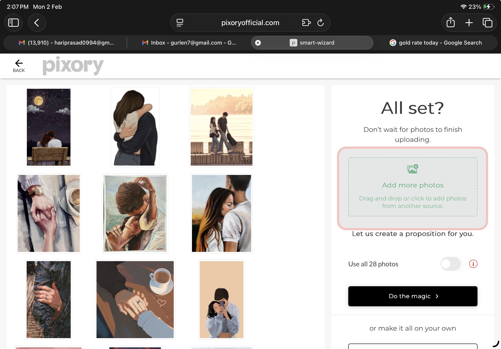  
2. On hover over the selected photos on left side there should be recycle bin icon on top left side of that photo  
  
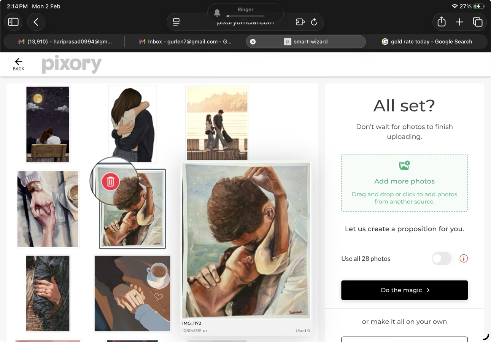  
3. on click of recycle bin icon that image will get deleted and count will be adjusted   
  
4. On click of ‘ Generate photo book’ a proposition will be created and the page will look as below with all selected images on left side and photo book proposition page by page on right side  
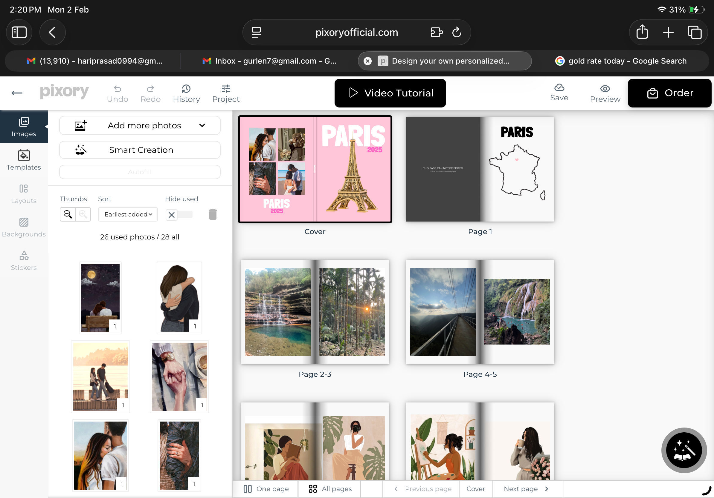  
5. On selecting any page thumbnail in the right side for example cover page an option to edit ‘ edit icon’ that page appears on top left corner of that thumbnail  
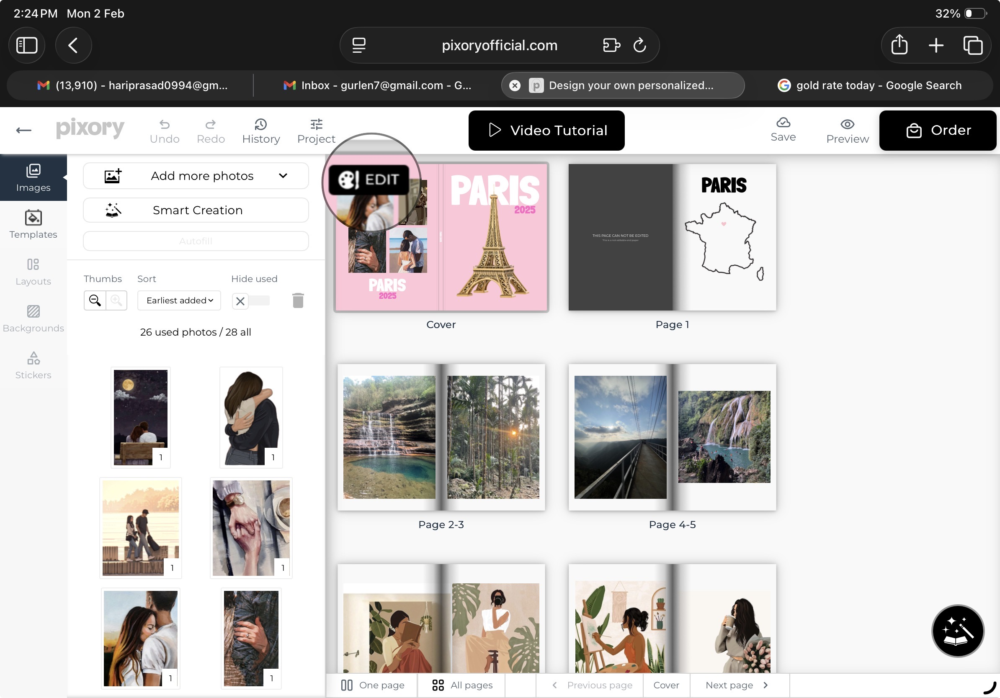  
  
6. On click of edit icon that particular page will zoom in on the right side of the screen as below  
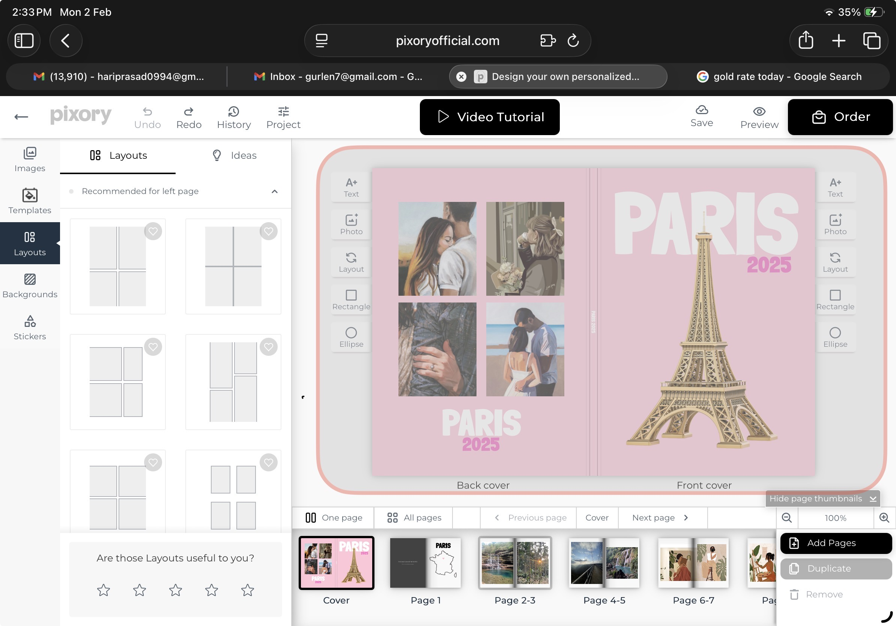  
7. All thumbnails will go at the bottom of the screen and are clickable   
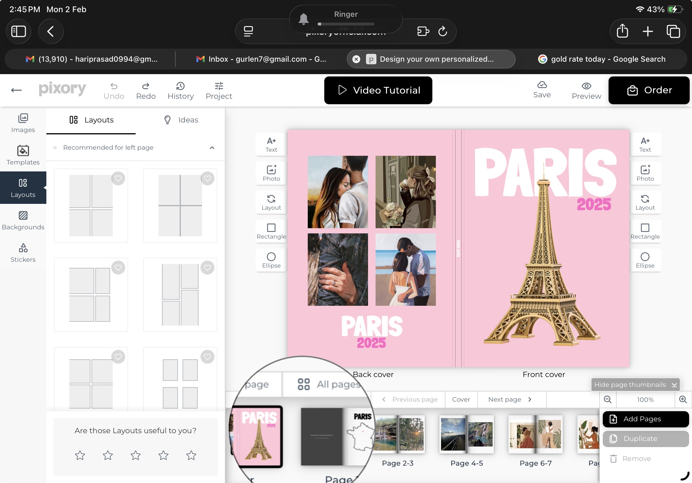  
8. Add page’ and ‘Remove page’ button should be at the bottom right of the screen. On click of ‘Add page’ a new blank page should get added and on click of ‘ Remove page’ selected page should get deleted  
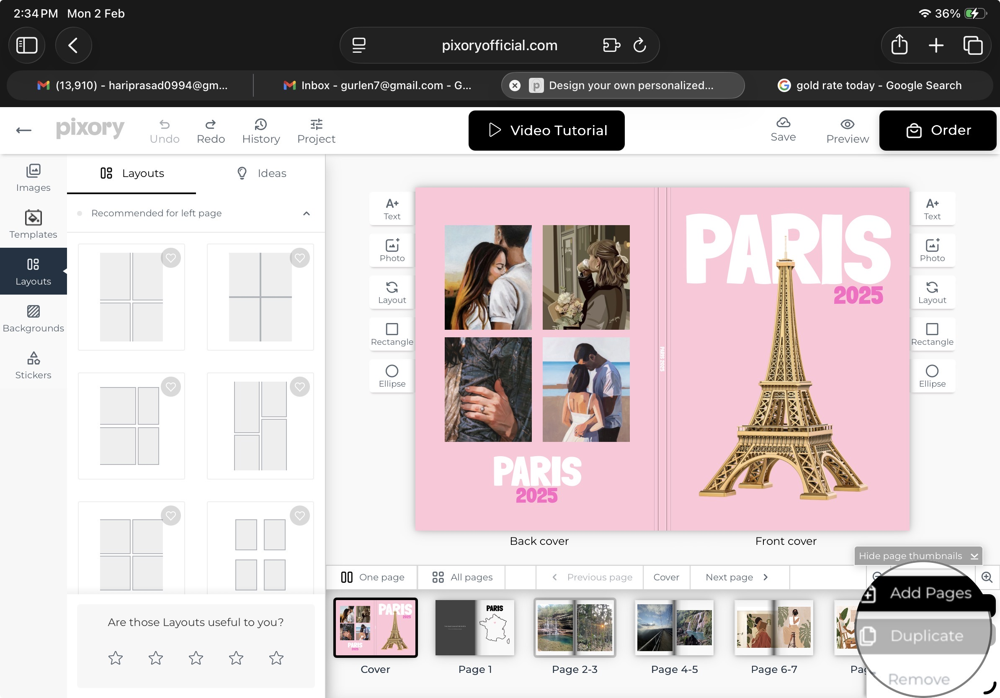  
  
9. The edit options like ‘add text icon’, ‘ change layout’ of images on that page, ‘add photo icon’ and ‘add shape’ and ‘add sticker’ should be given on the left top and right top of respective pages  
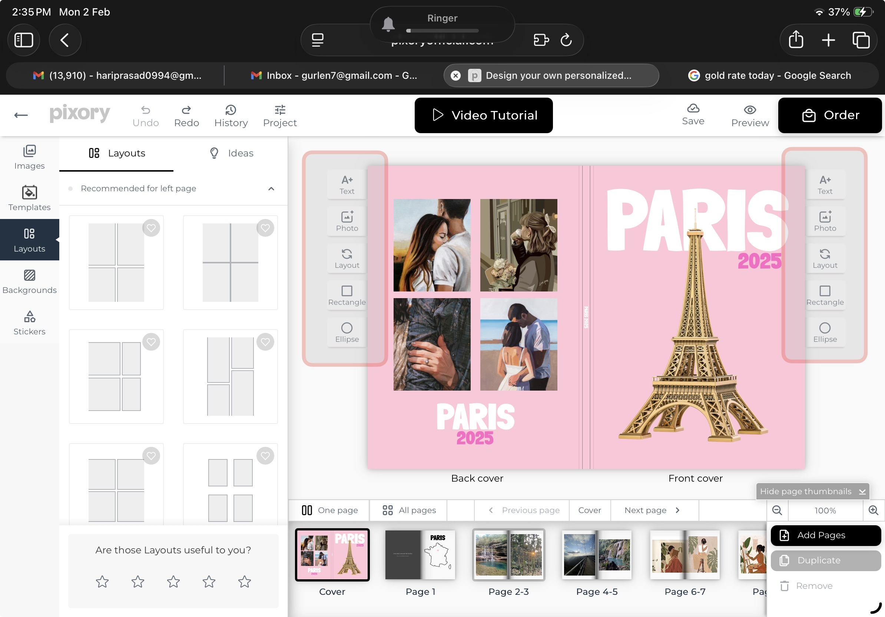  
10. On click of ‘add text icon’ the editable text box appears in the center of the page for a user to add the text  
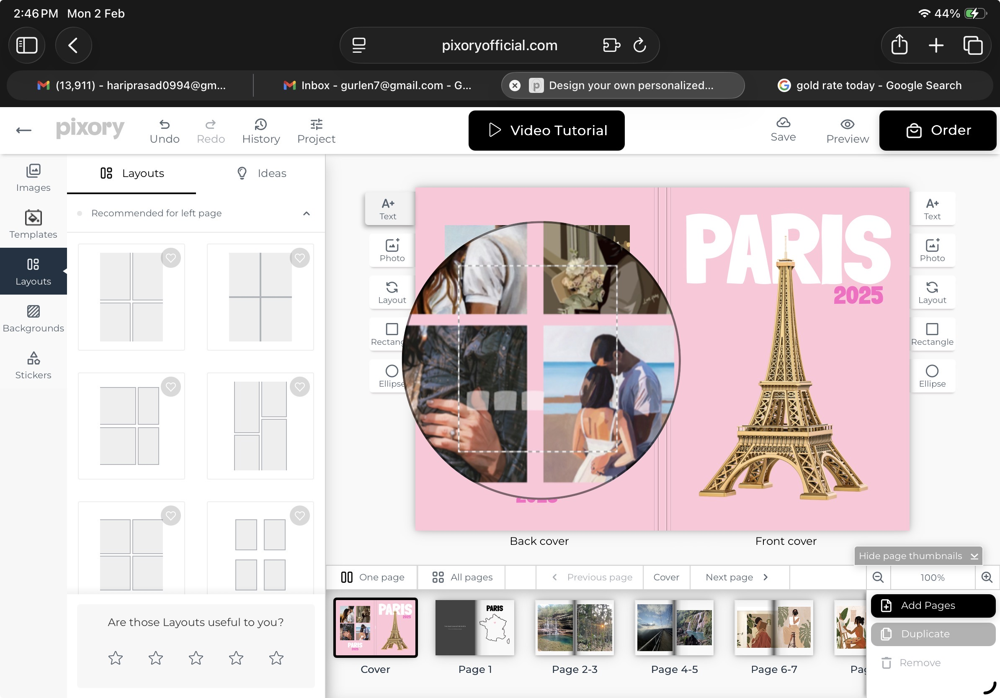  
11. On selecting that editable textbox the options to choose font style, font weight, align text, font color and delete the textbox options appear  
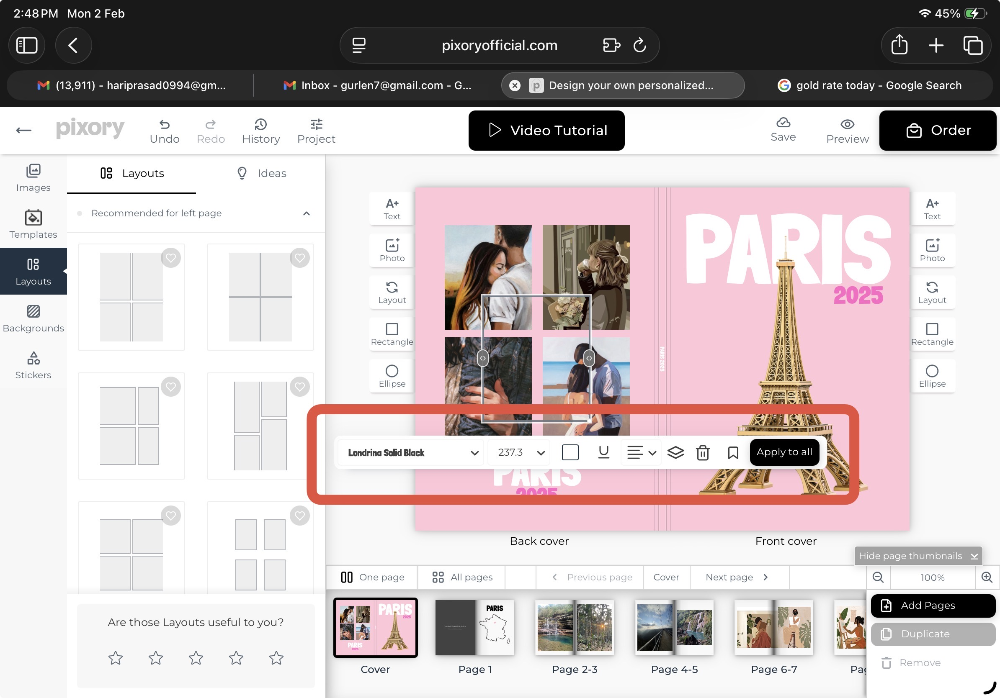  
12. On click of ‘ photo icon’ an image box should appear in the center of the page having text ‘drag here’ to appear   
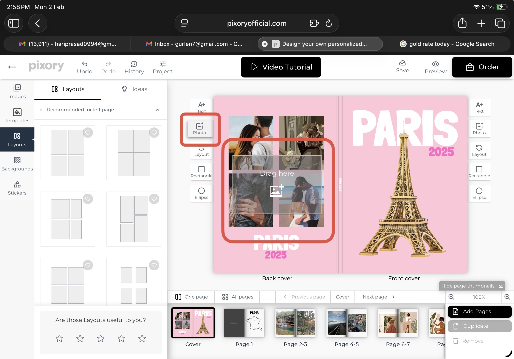  
13. On clicking the drag here image box the options to add the image should appear and edit the image or delete the image   
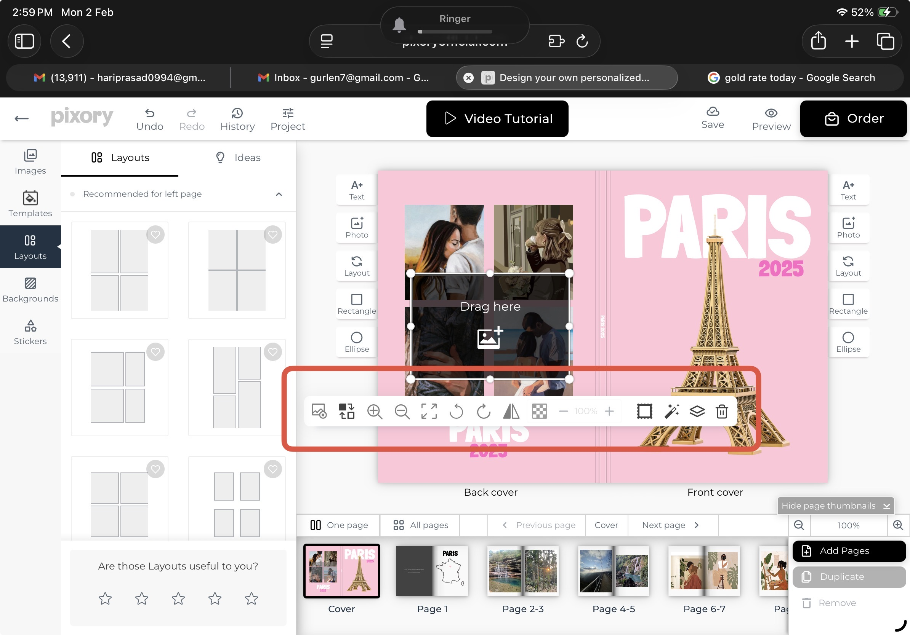  
