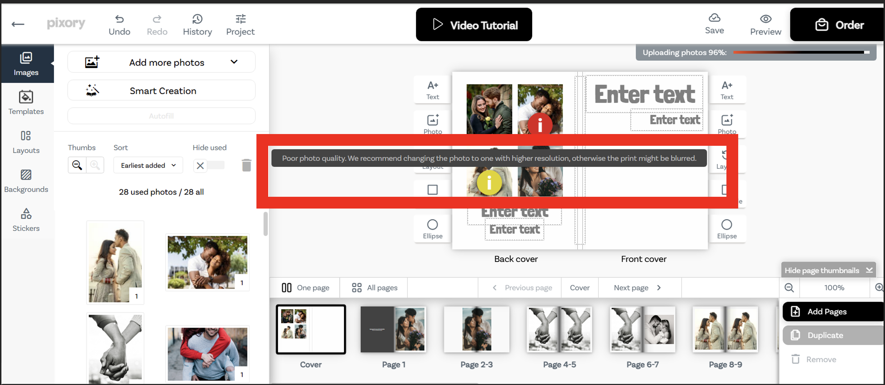
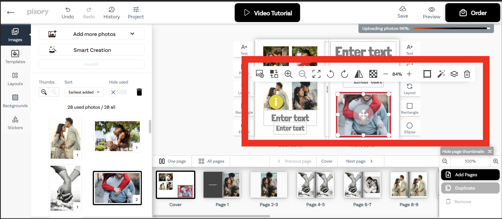
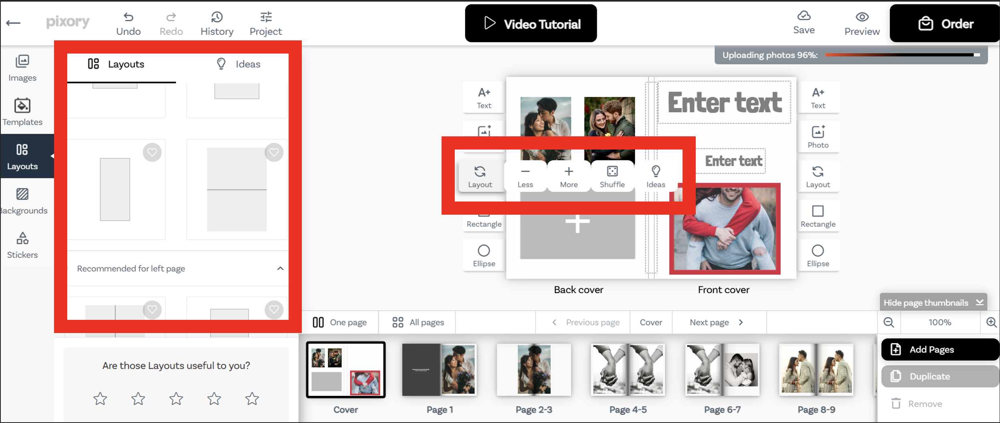
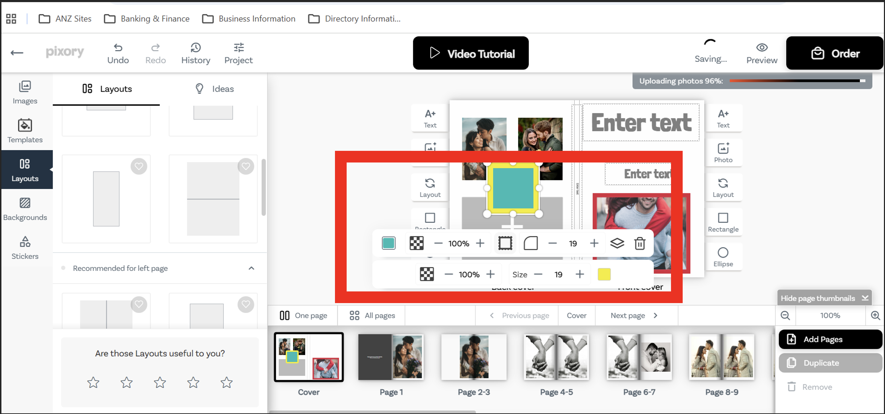
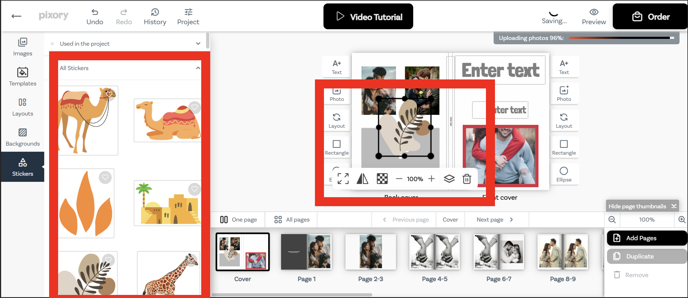
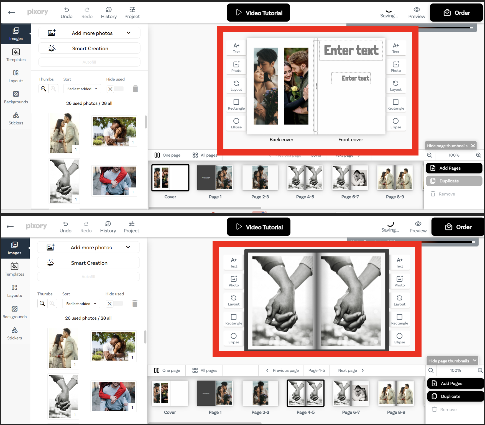
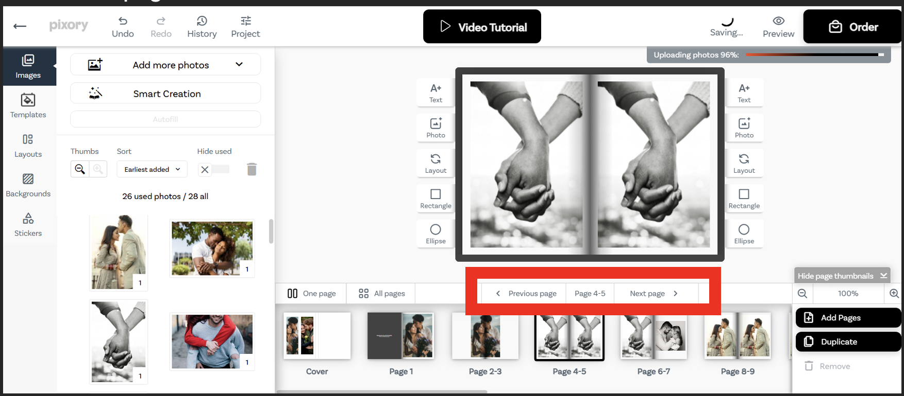
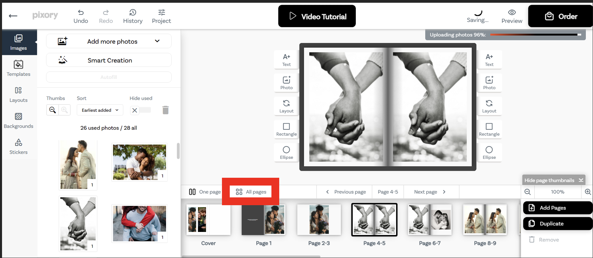
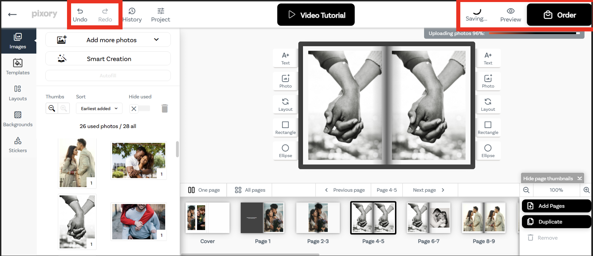
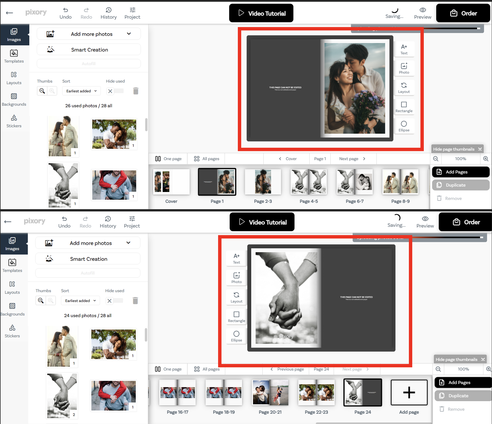

1) If the quality of image is low then show a warning icon and on hover over icon show the tooltip as below

2) On click of Add text icon/option the textbox should have by default the “60.6” font-size and font style to be “Londrina Solid Black” font-color to be “black”

3)	On click of Add photo icon/option the empty box should appear in the center of the page with “+” icon in the centre and all the photos that we uploaded earlier should appear in the left pane and can drag any photo and on dropping on the right pane should appear in that newly/selected photo area
On click of photo slot/component the options should appear as
- Remove photo from the design : which will remove the photo if added
-	Zoom in, Zoom out, Fit the photo within slot
-	Rotate left, Rotate right, Flip image
-	Add frame to the photo slot : with an option to change color and font/width
-	Change layer order – that photo slot should appear on top of text or any other component or beneath it
-	Add photo effect and
-	Remove : phot slot/component

4)	On click of layout icon/option, various layout options should appear on the left pane and on the right pane the options should appear as
-	Less “-“ icon : which will remove one photo slot from the page and will adjust the remaining slots so that it fits within that page
-	More “+” icon : which will add one new photo slot to the page and will adjust the already existing slots along with newly added slot so that it fits within the page.
-	Shuffle icon : will shuffle the layout of the photo slots

5)	Instead of having two icons of “Rectangle” and “Circle” would like to have one to “Add Shapes” – on click of which an option to select different shapes should appear like “basic shapes - Rectangle, circle, oval, stars and banners, callouts”
On selecting that shape the options should appear as below
-	Resize the shape
-	Remove
-	Add color
-	Add border : change the border color and size 
-	Change layer order – that shape should appear on top or beneath

6)	Add Sticker icon/option should open the stickers on the left pane which as user can drag and drop on the right pane anywhere on the page
On selecting the sticker added on the page, it should the options as 
-	Remove
-	Resize
-	Flip
-	Change layer order – that sticker should appear on top or beneath

7)	Two - two pages should appear on the Right pane of editScreen for example: Back Cover and Front Cover, Page1-2, Page

8) There should be a control to move to previous or next page and also display the current page

9)	There should be a back button to go to All pages of that particular photobook

10) The toolbar at the top should have options to redo, undo, auto save – entire photobook, preview – the photobook and order button

11)	 The photobook should be limited to 20 pages and page behind the front and back cover page should not be editable

